# Mario_Agent57
Playing Super Mario Bros using Agent57

## Introduction

My PyTorch Agent57 implementation for playing Super Mario Bros (This is [Agent57 paper](https://arxiv.org/pdf/2003.13350)). My code uses a synchronous version of R2D2 (SR2D2) instead of the original R2D2 because it runs easier on 1 machine. You can see my SR2D2 here: [Mario_Synchronous_R2D2](https://github.com/CVHvn/Mario_Synchronous_R2D2).

  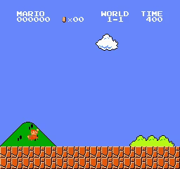
  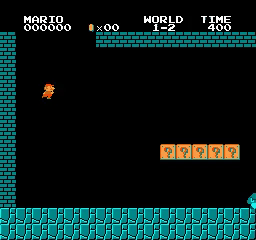
  
   
  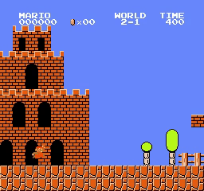
  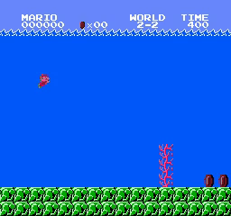
  
  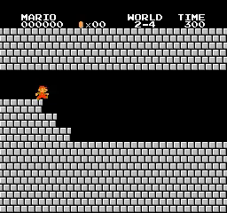 
  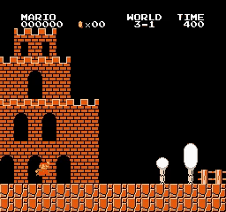
  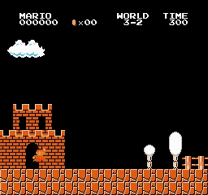
  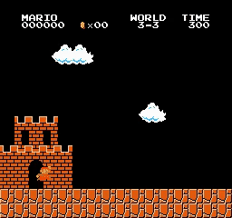
   
  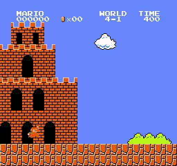
  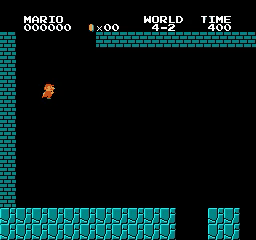
  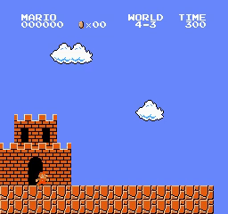
  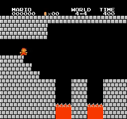 
  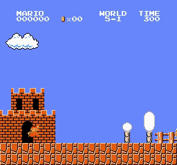
  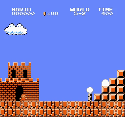
  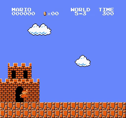
   
  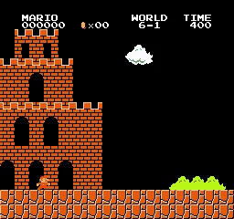
  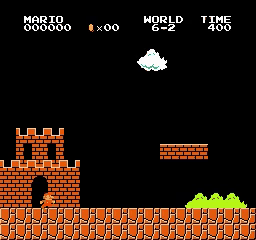
  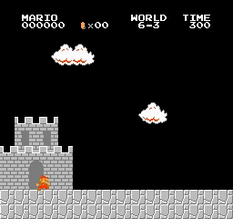
  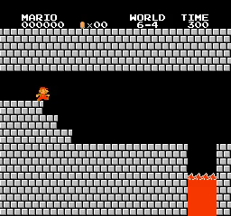 
  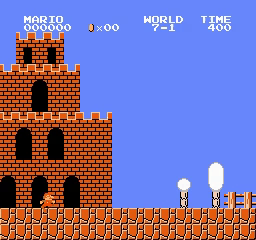
  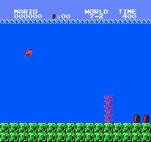
  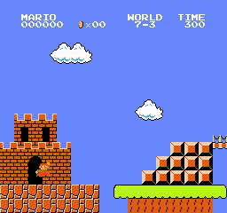
   
  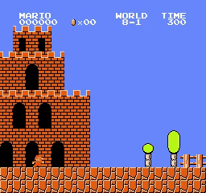
  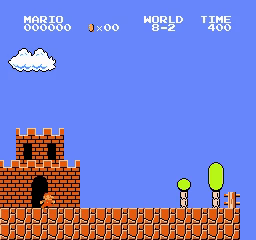
  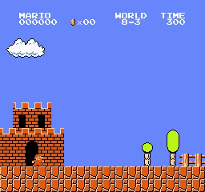
  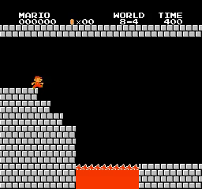 
  <i>Results</i>

## Motivation

After implementing [NGU](https://github.com/CVHvn/Mario_NGU) (with SR2D2 base), I couldn't use it to complete stage 8-4 as expected. But I know that NGU with SR2D2 is very good (because the [SR2D2 project](https://github.com/CVHvn/Mario_Synchronous_R2D2) project works better than the [PPO project](https://github.com/CVHvn/Mario_PPO) and NGU intrinsic reward + PPO (NGU project) works very well). I tried finetuning hyperparameters for NGU + SR2D2, but it didn't work. I know Agent57 is not too different from NGU. Then I tried implementing Agent57 to check what was wrong instead of wasting resources on NGU.

After running, Agent57 completed all stages as expected. Then I found two things that could be the reason NGU isn't working: high replay ratio and high intrinsic reward coefficient. I tried fixing both problems with the NGU project and found that a high intrinsic reward coefficient is the problem that makes NGU have poor performance. When I divided the intrinsic reward by 10, NGU worked. I didn't try a higher replay ratio, but I think a higher replay ratio will work better and make the agent learn faster with both NGU and Agent57.

## How to use it

You can use my notebook for training and testing agent very easy:
* **Train your model** by running all cell before session test
* **Test your trained model** by running all cell except agent.train(), just pass your model path to agent.load_model(model_path)

Or you can use **train.py** and **test.py** if you don't want to use notebook:
* **Train your model** by running **train.py**: For example training for stage 1-4: python train.py --world 1 --stage 4 --num_envs 8
* **Test your trained model** by running **test.py**: For example testing for stage 1-4: python test.py --world 1 --stage 4 --pretrained_model best_model.pth --num_envs 2

You just need to adjust the hyperparameters in the config section.

## Trained models

You can find trained models in the folder [trained_model](trained_model). I use multiple models, so I saved multiple files for each agent. You can see how to load these files in the test session of the notebook/source code.

## Hyperparameters

Below is a detailed hyperparameter table for Agent57

| Hyperparameters | Value | Value in paper | Note |
| :--- | :--- | :--- | :--- |
| **num_envs** | 32 | 256 | |
| **num_policies** | 32 | | |
| **learn_step** | 16 | 52 | |
| **batchsize** | 32 | 64 | |
| **gamma0** | 0.9999 | | | 
| **gamma1** | 0.997 | | |
| **gamma2** | 0.99 | | |
| **beta_min** | 0 | | |
| **beta_max** | 0.3 | | |
| **learning_rate** | 1e-4 | | policy model |
| **learning_rate_int** | 5e-4 | | rnd and embedding model |
| **embedding_wd** | 1e-5 | | weight decay for embedding model |
| **adam_eps** | 1e-4 | | eps in Adam optimizer |
| **max_grad_norm** | 40 | | |
| **loss_type** | mse | | |
| **target_update_freq** | 1500 | | |
| **replay_buffer_size** | 5e4 | | |
| **replay_buffer_sample_size** | 4e6 | | |
| **per_eps** | 1e-2 | | |
| **per_alpha** | 0.9 | | |
| **per_beta** | 0 | | |
| **eta** | 0.9 | | |
| **m** | 40 | | |
| **l** | 80 | | |
| **n** | 5 | | I use n-step Q learning, NGU use RETRACE |
| **start_learning_sequence** | 6250 | | |
| **k** | 10 | | |
| **kernel_cluster_distance** | 0.008 | | |
| **kernel_epsilon** | 0.0001| | |
| **c** | 0.001 | | |
| **sm** | 8 | | |
| **UCB_n** | 32 | | code it in UCB class |
| **UCB_size** | 90 | | code it in UCB class |
| **UCB_epsilon** | 0.5 | | code it in UCB class |
| **UCB_beta** | 1 | | code it in UCB class |

### How to find hyperparameters:

- The hyperparameters for calculating `episodic_reward` (pseudo-counts reward) are `k = 10, kernel_cluster_distance = 0.008, kernel_epsilon = 0.0001, c = 0.001, and sm = 8`, the same as in the Agent57/NGU paper.
- The hyperparameters for UCB are same as in Agent57 paper: `n = 32`, `size = 90`, `epsilon = 0.5` and `beta = 1`.
- `adam_eps = 1e-4`, `embedding_wd = 1e-5`, `learning_rate = 1e-4` and `learning_rate_int = 5e-4`, the same as in the Agent57 paper.
- `num_envs = 32`: the same as previous projects. Set `num_envs = 256` if available. Because 256 runs very slowly, I decreased `num_envs` to 32.
- `batchsize = 32`: The Agent57 paper sets `batchsize = 64`, but I decreased `num_envs` from 256 to 32 and `learn_step` from 52 to 16. I wanted a lower `batchsize` to decrease (balance) the `replay ratio`. Also, decreasing `batchsize` can help the agent learn faster. I'm not sure if it affects performance. If you can, please set it to 64.
- `max_grad_norm = 40`, `target_update_freq = 1500`: like in the Agent57 paper.
- `gamma0, gamma1 and gamma2: 0.9999, 0.997 and 0.99`: like in the Agent57 paper.
- `beta_min, beta_max: 0 and 0.3`: like in the Agent57 paper.
- `replay_buffer_size = 1e5`, `replay_buffer_sample_size = 4e6`: like in the R2D2 paper.
- `start_learning_step = 50000`: like in the R2D2 and Ape-X papers (the R2D2 paper mentioned that other unlisted hyperparameters are the same as in the Ape-X paper).
- `start_learning_sequence = 6250`: like in the Agent57 paper.
- `per_eps = 1e-2`, `per_alpha = 0.9`, `per_beta = 0`: like in the Agent57 paper. These are hyperparameters for PER.
- `eta = 0.9`: like in the Agent57 paper. This is used to balance the mean and max TD errors in a sequence when calculating priority.
- `loss_type = mse`: like in the R2D2 paper.
- `burn-in step (m) = 40`, `sequence length (l) = 80`, `n-steps (n) = 5`: like NGU project but I increase l to 80 because Agent57 use 80 and they said longer sequence length work better. Note that Agent57 uses Retrace loss, whereas I use n-step loss.
- `learn_step = 16`: Tuned. Please set to `52` if you have enough time and resources to wait. This value impacts the `replay ratio` (the effective number of times each experienced observation is replayed):
  - When I try NGU, I set `learn_step = 4` like in the SR2D2 project, but it didn't work.
  - I tune some hyperparameters for NGU but it still not work.
  - I find two things that maybe two problems: low replay ratio (low learn_step) and high intrinsic reward.
  - Because Agent57 split intrinsic and extrinsic brands, I don't need to decrease intrinsic reward.
  - I increate `learn_step = 16` as default and it work in first run.
  - I try `learn_step = 16` for NGU but it still not work. Then I think problem is high intrinsic reward.
  - I devide intrinsic reward by 10 and NGU work.
  - I think `learn_step` is not problem for both Agent57 and NGU. I recommend use `learn_step = 4` for faster learning.

### Actor, Policies, gamma and beta

In the Agent57 paper, they use 32 policies and 256 actors. Each actor has its own epsilon (for using epsilon-greedy); epsilon gradually decreases from low id agents to high id agents. Thus, low id agents tend to explore randomly, while high id agents exploit to achieve the highest extrinsic reward.

Because of epsilon-greedy, linking 1 actor with 1 policy (like NGU) may not be optimal because another policy might work better with this actor. Agent57 uses UCB to select which policy to use in each episode (choosing a policy every episode). This allows one actor can use multiple policies across different episodes.

Each policy has a pair (beta, gamma). Low index policies have high gamma and low beta:
- High gamma makes the agent focus more on future rewards (long-term view). It makes the model tend to exploit more than explore.
- Low beta makes extrinsic reward more important than intrinsic reward. It makes the model tend to exploit to get the highest extrinsic reward.

Below is a chart of epsilon (using 32 actors)

  <table border="0">
    <tr align="center">
      <td>
        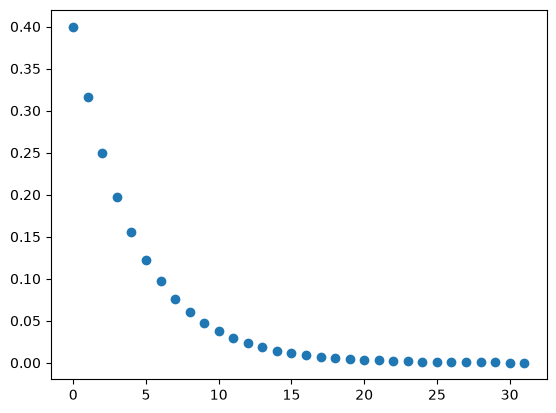
      </td>=
    </tr>
    <tr align="center">
      <td><b>Epsilon</b></td>
    </tr>
  </table>

Below is chart of gamma and beta

  <table border="0">
    <tr align="center">
      <td>
        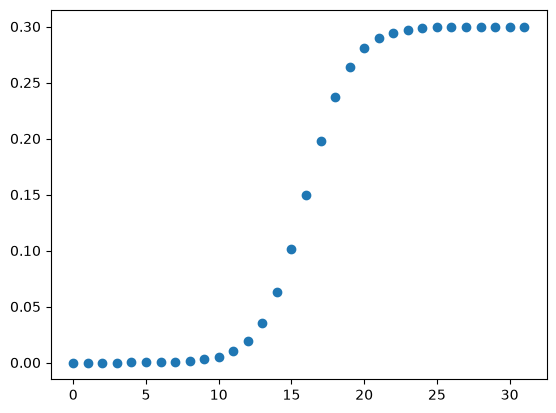
      </td>
      <td>
        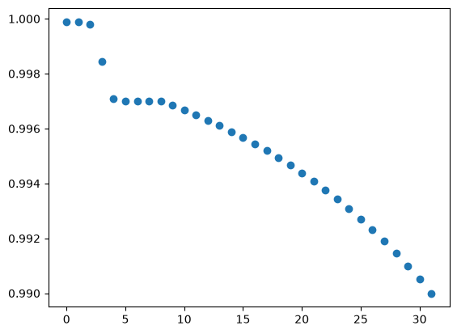
      </td>
    </tr>
    <tr align="center">
      <td><b>Beta</b></td>
      <td><b>Gamma</b></td>
    </tr>
  </table>

## Training step and training time

| World | Stage | training_step | training_time    |
|-------|-------|---------------|------------------|
| 1 | 1 | 61200 | 1:50:34.728179 |
| 1 | 2 | 220000 | 6:31:06.920773 |
| 1 | 3 | 1135600 | 18:03:36.440850 |
| 1 | 4 | 60000 | 2:00:53.084450 |
| 2 | 1 | 256800 | 4:19:50.443535 |
| 2 | 2 | 95200 | 1:33:26.464959 |
| 2 | 3 | 168800 | 3:56:27.704286 |
| 2 | 4 | 144800 | 3:52:22.017100 |
| 3 | 1 | 154000 | 5:04:42.679509 |
| 3 | 2 | 56800 | 1:47:44.111298 |
| 3 | 3 | 183600 | 5:38:28.840374 |
| 3 | 4 | 107600 | 1:38:41.704755 |
| 4 | 1 | 105600 | 1:35:30.289139 |
| 4 | 2 | 389600 | 6:28:04.150107 |
| 4 | 3 | 1645600 | 1 day, 2:49:49.559873 |
| 4 | 4 | 242800 | 4:32:04.157877 |
| 5 | 1 | 176000 | 5:40:38.555927 |
| 5 | 2 | 458000 | 13:58:51.619234 |
| 5 | 3 | 977600 | 15:34:19.248589 |
| 5 | 4 | 158000 | 2:31:58.635437 |
| 6 | 1 | 82400 | 2:46:57.344888 |
| 6 | 2 | 330800 | 11:54:37.815460 |
| 6 | 3 | 362400 | 5:47:29.644174 |
| 6 | 4 | 119200 | 2:21:56.496281 |
| 7 | 1 | 151200 | 4:51:42.241257 |
| 7 | 2 | 274400 | 8:38:40.260314 |
| 7 | 3 | 291600 | 8:17:39.435194 |
| 7 | 4 | 336000 | 5:32:56.066224 |
| 8 | 1 | 1108000 | 19:34:05.012988 |
| 8 | 2 | 618000 | 9:39:55.204139 |
| 8 | 3 | 345600 | 5:21:42.872188 |
| 8 | 4 | 2227600 | 1 day, 18:56:01.694472 |

## Questions and Discussion

* Is this code guaranteed to complete the stages if you try training?
    - I complete all 32/32 stages in the first time I run.
    - With my experience, Agent57 can complete every time you run.

* How long do you train agents?
  - Within a few hours to 1 day. Time depends on hardware, I use many different hardware so time will not be accurate.

* How can you improve this code?
  - You can separate the test agent part into a separate thread or process. I'm not good at multi-threaded programming, so I didn't do this.
  - You can tune hyperparameters:
    - For SR2D2/R2D2: Some new research recommends that we can use a higher replay ratio, like in [MEME](https://openreview.net/pdf/b23bc123e103d66e46f6b7516e3fb6dffd1d2cba.pdf), to learn faster without decreasing performance.
    - Some research ([BBF](https://arxiv.org/pdf/2305.19452), [ReDo](https://arxiv.org/pdf/2302.12902)) on sample efficiency recommends using a stronger model, a reset strategy and data augmentation, which can make the agent learn better and eliminate overfitting even when using a very high replay ratio.
    - Try RETRACE loss.
  - Implement R2D2 instead of SR2D2.
  - Try better algorithms!

* Compare with NGU?
  - Agent57 works better, faster, and more stably than NGU.
  - NGU merges intrinsic reward and extrinsic reward within 1 value function. It makes the intrinsic reward coefficient become an important hyperparameter (like the problem I met when trying NGU). Agent57 separates two value function branches, so we can ignore the value range of both intrinsic and extrinsic rewards.
  - NGU links 1 actor with 1 policy. This is not optimal because we can't know which policy will yield the best performance. And this becomes an important issue when we use a small number of actors. I randomly chose a policy every episode to prevent this problem. But Agent57 uses UCB to select policies, which is a better strategy.
  - Agent57 uses longer sequences (80 compared with 40 in NGU).

* Why pretrained weights can't complete stage?
    - Because of different packages, sometimes pretrained programs will behave differently and not complete the stage (e.g., running on Colab). Make sure your settings match mine. However, if you train from scratch or use my code, it shouldn't be affected.
    - I use vastai/pytorch:cuda-x-auto docker (x from 12.8.1 to 13.2.1, Other versions x that are close to the one I listed still work.). And then pip install requirement.

## Requirements

* **python 3>3.6**
* **gymnasium==0.29.1**
* **gym-super-mario-bros==7.4.0**
* **gym==0.25.2**
* **imageio**
* **imageio-ffmpeg**
* **opencv-python-headless**
* **pytorch** 
* **numpy==1.26.4**

## Acknowledgements
With my code, I can completed all 32/32 stages of Super Mario Bros. 

## Reference
* [Agent57 paper](https://arxiv.org/pdf/2003.13350)
* [NGU paper](https://arxiv.org/pdf/2002.06038)
* [R2D2 paper](https://arxiv.org/abs/1707.06347)
* [Howuhh PER](https://github.com/Howuhh/prioritized_experience_replay/blob/main/memory/buffer.py)
* [ZiyuanMa R2D2](https://github.com/ZiyuanMa/R2D2/tree/main)
* [Coac NGU](https://github.com/Coac/never-give-up/tree/main)
* [yuta0821 agent57_pytorch](https://github.com/yuta0821/agent57_pytorch)
* [jcwleo RND](https://github.com/jcwleo/random-network-distillation-pytorch/blob/master/utils.py)
* [DI-engine RND](https://opendilab.github.io/DI-engine/12_policies/rnd.html)
* [vwxyzjn cleanrl/ppo_rnd_envpool.py](https://github.com/vwxyzjn/cleanrl/blob/master/cleanrl/ppo_rnd_envpool.py)
* [Stable-baseline3 ppo](https://stable-baselines3.readthedocs.io/en/master/_modules/stable_baselines3/ppo/ppo.html#PPO)
* [CVHvn A2C](https://github.com/CVHvn/Mario_A2C)
* [CVHvn PPO](https://github.com/CVHvn/Mario_PPO)
* [CVHvn SR2D2](https://github.com/CVHvn/Mario_SR2D2)
* [uvipen PPO](https://github.com/uvipen/Super-mario-bros-PPO-pytorch)
* [lazyprogrammer A2C](https://github.com/lazyprogrammer/machine_learning_examples/tree/master/rl3/a2c)

